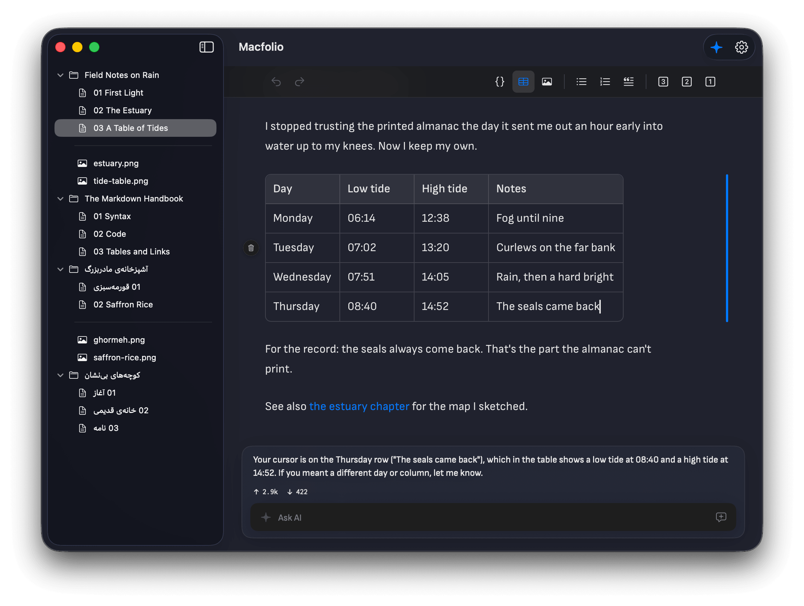
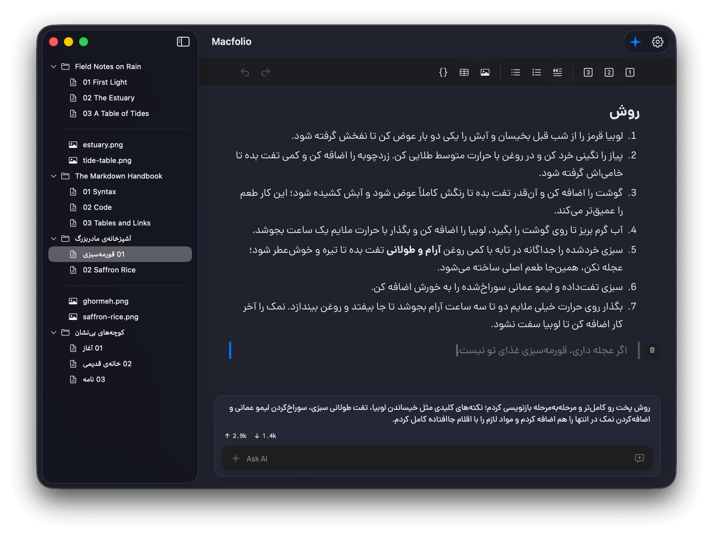

# Macfolio

**Mac** + **Folio** — a leaf of a book

**Write books and articles with Claude as your co-author — on your Mac or iPad, in your language.**

Macfolio is a native authoring studio for **macOS and iPad**. It turns Claude into a co-writer that
drafts and revises your manuscript's chapters as plain Markdown files in a folder you own. On the Mac
it can ride the Claude Code CLI you already have — no new login, no web panel — or you can point it at
your own **Claude API** or **OpenAI** key; on iPad, an API key is all it needs. Right-to-left first.



Right-to-left first — Persian and English mix freely, per paragraph:



## Why Macfolio

- **Use what you have, or bring a key.** On the Mac it rides the Claude Code CLI you already have, so
  there's no sign-in screen — or point it at your own **Claude API** or **OpenAI** key in Settings.
  On iPad, an API key is all you need.
- **Your book is just a folder.** Every chapter is a `.md` file under `~/Documents/Macfolio`. Plain
  text you can grep, back up, version with git, or open in any other editor. Nothing is locked in a
  database or a cloud.
- **Truly right-to-left.** Direction is decided per paragraph — Persian flows right-to-left, English
  and code left-to-right, mixed in the same document without a single language setting.
- **A real WYSIWYG editor, not a chat window.** You write in a polished editor; the co-author works
  alongside you in the same file.

## Features

### Write

- **Lexical WYSIWYG editor** — headings, **bold**/_italic_, bullet and numbered lists, quotes, fenced
  code blocks, tables, links, and images, all rendered inline as you type.
- **Markdown typing shortcuts** — `#`, `-`, `>`, ` ``` `, and friends transform on the fly, so your
  hands never leave the keyboard.
- **Automatic RTL** via `dir="auto"` on every paragraph, with the bundled **Dana** font (Persian +
  English) for a consistent look across any Mac.

### Co-author

- **A co-writer that edits in place.** Ask for a new chapter, a rewrite, a tighter paragraph — the
  agent creates and edits the Markdown files directly, and the editor updates live.
- **Knows where your cursor is.** Your open chapter, your selection, and the current line are passed
  to the agent, so “expand this”, “rewrite the selection”, or “remove this line” just work.
- **Progress you can watch.** The chat footer streams the co-author's work as a live checklist, and
  shows the **token usage** for each turn right under the reply.
- **Per-book memory.** Each book keeps its own conversation context, so the co-author has your whole
  manuscript in mind — switch books and it follows. (A persistent CLI session with Claude Code; kept
  per book in the app with the API backends.)
- **Start fresh anytime.** One click resets the session, clearing prior context for a clean slate.

### Organize

- **Books › chapters sidebar.** A clean tree of every book and its chapters, kept in reading order.
  Right-click a chapter to edit its metadata, rename, or delete it; add new chapters per book.
- **Chapter metadata.** Each chapter carries **Jekyll-style front matter** — `title`, `order`, `date`,
  `tags` — edited in a small form and kept at the top of the `.md` file (hidden from the editor). The
  sidebar sorts by `order`, and any extra front-matter keys you add are preserved untouched.
- **Media at a glance.** Images inside a book (e.g. an `images/` folder) are listed alongside its
  chapters.
- **Snapshots & history** _(macOS)_. Version each book with one click — Macfolio keeps a per-project
  git repo, so you can browse the timeline, **restore** an earlier snapshot (non-destructively), or
  remove one. Handy for undoing a round of the co-author's edits.

### Fits right in

- **Native and lightweight.** A native SwiftUI app for macOS and iPad — no Electron.
- **Follows your system.** Honors the system accent color and light/dark appearance.
- **Local first.** Your manuscript stays on disk; with Claude Code nothing appears in the web panel.

## AI backend & control

Choose your co-author in **Settings**:

- **Provider** — **Claude Code** (the local CLI, macOS only), the **Claude API**, or **OpenAI**.
- **Model** — Claude **Opus 4.8** / **Sonnet 5** / **Haiku 4.5**, or OpenAI **GPT-4o** / **GPT-4.1**
  (and their mini variants).
- **Permission mode** _(Claude Code only)_ — **Bypass** (no prompts, the default), **Accept Edits**,
  or **Plan**.

The Claude API and OpenAI backends have no file tools of their own, so Macfolio runs the editing loop
for them — the model calls read/write/edit tools against your book's `.md` files until the change is
done.

## Build

    make run                                              # build the app and launch it
    make release                                          # universal release build
    make format                                           # swift-format the sources

`make run` builds the Lexical (Notion-style) WYSIWYG editor bundle into `build/editor/` (via Vite,
installing npm deps on first run) and embeds it in the app. If npm is unavailable, the manuscript
pane falls back to a read-only preview, so the app still runs — you just can't edit in place yet.

The iPad app builds from `Macfolio.xcodeproj` (the **Macfolio (iOS)** target) in Xcode.

## Requirements

- macOS 13+, or iPadOS 16+
- An AI backend — one of:
    - the [Claude Code CLI](https://docs.claude.com/en/docs/claude-code/setup), installed and
      authenticated (macOS only), or
    - a **Claude API** or **OpenAI** API key
- Node.js 18+ (only to build the editor bundle)
